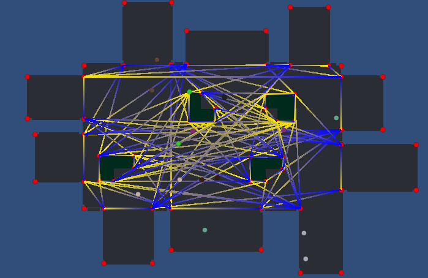

# Path Finding

#### Assignment 3 @ COMP-521

The results below are obtained from simulating for 60 seconds.

###### 2 Agents

------

| #    | Successful | Path Planned | Path Re-planned | Total Planning Time (ms) |
| ---- | ---------- | ------------ | --------------- | ------------------------ |
| 1    | 44         | 44           | 0               | 11.479                   |
| 2    | 36         | 48           | 11              | 22.1644                  |
| 3    | 42         | 58           | 14              | 20.0816                  |
| Avg  | 41         | 50           | 8               | 17.9083                  |

###### 4 Agents

------

| #    | Successful | Path Planned | Path Re-planned | Total Planning Time (ms) |
| ---- | ---------- | ------------ | --------------- | ------------------------ |
| 1    | 71         | 116          | 43              | 20.4988                  |
| 2    | 82         | 111          | 25              | 22.4063                  |
| 3    | 84         | 113          | 27              | 23.8855                  |
| Avg  | 79         | 113          | 31              | 22.2635                  |

###### 8 Agents

------

| #    | Successful | Path Planned | Path Re-planned | Total Planning Time (ms) |
| ---- | ---------- | ------------ | --------------- | ------------------------ |
| 1    | 149        | 294          | 138             | 53.7201                  |
| 2    | 149        | 313          | 158             | 55.3343                  |
| 3    | 154        | 252          | 90              | 37.7279                  |
| Avg  | 151        | 286          | 127             | 48.9274                  |

###### 16 Agents

------

| #    | Successful | Path Planned | Path Re-planned | Total Planning Time (ms) |
| ---- | ---------- | ------------ | --------------- | ------------------------ |
| 1    | 241        | 963          | 707             | 106.2626                 |
| 2    | 254        | 802          | 535             | 131.3696                 |
| 3    | 296        | 822          | 515             | 95.6203                  |
| Avg  | 264        | 862          | 586             | 111.0842                 |

###### 32 Agents

------

| #    | Successful | Path Planned | Path Re-planned | Total Time (ms) |
| ---- | ---------- | ------------ | --------------- | --------------- |
| 1    | 365        | 2622         | 2230            | 357.3556        |
| 2    | 366        | 2668         | 2274            | 313.1011        |
| 3    | 373        | 2684         | 2285            | 291.9881        |
| Avg  | 368        | 2658         | 2263            | 320.8149        |

Starting from 16 agent we see a slight decline in the average successful path planned. Behavior is starting to become unacceptable after 32 Agents, although the frame rate is still high. Sometimes, more agents will have paths colliding with each other, and this issue is pronounced when you have a cluster of agents colliding in the same region. In such cases, agents kept pushing back and bumping into each other which staled the whole movement.

